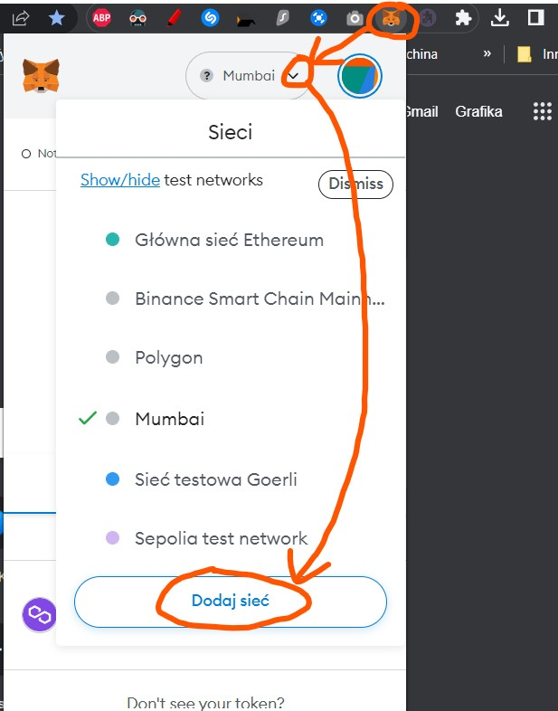
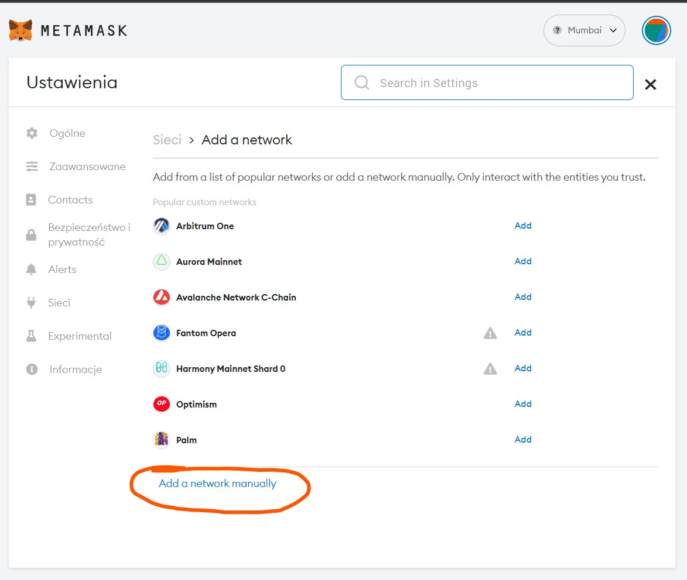
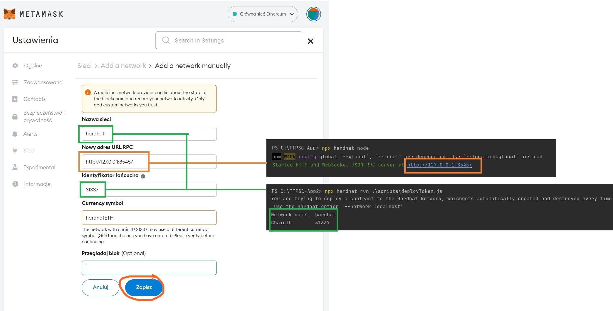

# TTPSC-App

## About

The main goal of this project is to create a decentralised system that will allow employees to receive tokens and
exchange them for different rewards. The whole project is based on blockchain technology and makes practical use of
smart contracts and cryptocurrency.

## Requirements

    NodeJS > 16.x
    Metamask

### Project is developed with hardhat

Try running some of the following tasks:

```shell
npx hardhat help
npx hardhat test
REPORT_GAS=true npx hardhat test
npx hardhat node
npx hardhat run scripts/deploy.js
```

Format your .sol files
```shell
npx prettier --write 'contracts/**/*.sol'
```

## Quick start

### Setup blockchain and deploy token smart contract on this blockchain

```shell
npx hardhat node
npx hardhat run scripts/deployToken.js --network localhost && npx hardhat run scripts/deploy.js --network localhost
```
### Connect to Mumbai network

To connect to remote network like Mumbai you need network RPC url and your private key.
Both can be found in metamask settings. If your network is not added to metamask go to  [chainlist.org](https://chainlist.org/)   
Follow these steps:
1. Create .env file in root directory  
2. Copy content .env.example and past to .env file
3. Fill your private data

You can verify contract deployment on network scanner like : [mumbai.polygonscan.com](https://mumbai.polygonscan.com/)


### Run frontend app

```shell
cd .\frontend\
npm i
npm run dev
```

### Add local blockchain node to Metamask

1. Install MetaMask
2. Config your wallet. Write your wallet password and passphrase
3. To add local blockchain network to metamask:
    1. Go to metamask menu 
    2. Click network manually 
    2. Fill form data. You get network name and chainID using ```npx hardhat run .\scripts\deployToken.js``` and network
       URL using ```npx hardhat node``` ( run commands from root project
       directory)  
4. Optionally you can add token to metamask to see balance. Do it using token smart contract address.

For more hardhat tips check [HardHat tutorial](https://hardhat.org/tutorial/testing-contracts)
